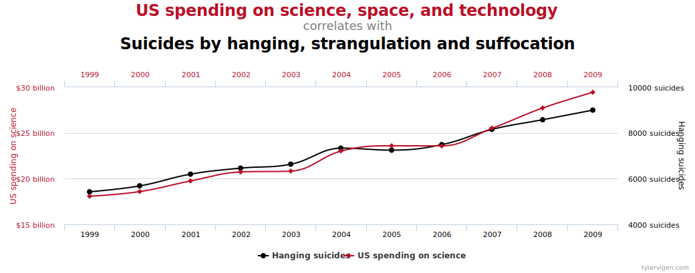

```{r setup, include=FALSE}
options(htmltools.dir.version = FALSE)
knitr::opts_chunk$set(fig.showtext = TRUE, warning=FALSE, cache=TRUE, cache.lazy=FALSE)
library(ggplot2)
library(patchwork)
library(dplyr)
library(showtext)
library(splines)
library(magick)
library(gganimate)
library(transformr)

```

```{r xaringan-themer, include=FALSE, warning=FALSE}
library(xaringanthemer)
style_duo_accent(
  primary_color             = "#5FB0EF", 
  text_bold_color           = "#075DB2", 
  title_slide_text_color    = "#FFFEF6", 
  inverse_background_color  = "#5FB0EF", 
  link_color                = "#075DB2",
  inverse_text_color        = "#FFFEF6", 
  inverse_header_color      = "#FFFEF6", 
  white_color               = "#FFFFFF",
  code_inline_background_color = "#ECECEC", 
  header_font_google        = google_font("Josefin Sans"), 
  text_font_google          = google_font("Montserrat", "300", "300i"),
  text_font_size            = "1.1rem",
  code_font_google          = google_font("Fira Mono"), 
  extra_css = list(
    ".title-slide h1"       = list("font-size" = "180%"),
    ".title-slide h2"       = list("font-size" = "260%",
                                   "padding-bottom" = "100px"),
    ".title-slide h3"       = list("font-size" = "120%")
  )
)
```

class: inverse

# submit panel questions

Please use the link below to submit anonymous questions for the student panel this afternoon, no later than 1pm EST today if possible! 

<br>
<br>

<h1>
.center[
[**Submit a question here!**](https://forms.gle/jX9ciADzb5SSDang8) 
]
</h1>

---
<!-------------------------------------->
<!-- REVIEW                           -->
<!-------------------------------------->
# review

So far this week, we've discussed the idea of **random variables** and their properties including:
  - Expected values  $\rightarrow\mathbb{E}(X)$
  - Variance $\rightarrow\text{Var}(X)$
  - Probability distributions, like the *Binomial distribution* for a discrete variable or *Normal distribution* for one that's continuous. 

<br>
But **why** do we actually care about these things? Why do we even need to worry about crazy expressions like the one below?
<br>
$$f(x)=\frac{1}{\sigma\sqrt{2\pi}}\exp\left\{-\frac{1}{2}\left(\frac{x-\mu}{\sigma}\right)^2\right\}$$


<font size="3">i.e. the PDF of a normal distribution, <b>please</b> don't actually memorize this -- it's on Wikipedia</font>

---

<!-------------------------------------->
<!-- A data generating world          -->
<!-------------------------------------->

# a data generating world

Ultimately, we're interested in these concepts because we can think of these distributions of random variables as an **approximation** of the world we live in -- and of the processes we wish to understand. In Public Health we might think of:
  - The number of events that occur in a given period of time (such as the number of hospitalizations per week) as a **Poisson** process.<sup>[1](https://onlinelibrary.wiley.com/doi/abs/10.1002/nur.20093)</sup>
  - Whether or not someone experiences pre-term birth as a **Binomial/Bernoulli** process.<sup>[2](https://www.sciencedirect.com/science/article/abs/pii/0002937895902872)</sup>  

--
  - From your favorite field of interest, what's another example of a **random variable** and what sort of distribution could it be represented by?

.center[

]

---

<!-------------------------------------->
<!-- A data generating world 2        -->
<!-------------------------------------->

# a data generating world

More often than not, we as public health researchers want to describe the relationship between *two or more* random variables. For example: 

<br>
<br>
- What is the relationship between **income** and **health**?
- Are people who **smoke** more likely to develop **lung cancer**?
- Is increased **air pollution** associated with **excess mortality** in children?
- Does exposure to a **sugary beverages tax** decrease risk of **obesity**?


---
class: inverse
<!-------------------------------------->
<!-- PLAN FOR TODAY                   -->
<!-------------------------------------->

# the plan for today

.large[
1. Introduce the F&Uuml;N Study

1. Relationships between variables

1. Intro to linear regression
1. Wrapping up + conclusions
]

---
<!-------------------------------------->
<!-- PLAN FOR TODAY 2                 -->
<!-------------------------------------->

# the plan for today

We will use `R` to explore different ways to assess relationships between variables. Interactive exercises can be found on the website below, but feel free to work on your own computer if you'd like.

.center[
[https://phs-summr2020.netlify.app/](https://phs-summr2020.netlify.app/)
]

<br>
This material is meant to introduce or refresh your memory of certain concepts, but it is **totally ok** if you don't understand everything: we will be returning to much of this over the course of the Fall semester.

--

<br>
*Questions:* If you have a question, feel free to type it into the Zoom chatbox and we'll return to it at various points in the presentation. You can always email me (**mlee8@g.harvard.edu**) or any of the other TF's if you think of something later on. 

---
class: inverse
<!-------------------------------------->
<!-- PLAN FOR TODAY                   -->
<!-------------------------------------->

# the plan for today

.large[
1. .largebinv[Introduce the F&Uuml;N Study]

1. Relationships between variables

1. Intro to linear regression
1. Wrapping up + conclusions
]

---
<!-------------------------------------->
<!-- The FUN Study                    -->
<!-------------------------------------->

# the F&Uuml;N study

To build our intuition of ideas, let's look at a silly made-up dataset from the **F**ollow-up of **&Uuml;**ber-cool Stude**N**ts (FUN). As part of the study, 10,000 doctoral students pursuing health-related degrees were asked to provide information on:

- `W`:  Whether the student is currently in their "dissertating" phase
- `A.con`: \# hours student slept last night
- `A.bin`: Whether student slept at least 8 hours (yes/no)
- `Y.con`: \# times student used a food delivery service (FDS) last week
- `Y.bin`: Whether FDS comprised ≥50% of the week's meals (yes/no)

<br>
A note: our outcome `Y.con` is continuous, rather than discrete, to take into account fractions of meals a student ate (e.g. snacks, second breakfasts)

---
<!-------------------------------------->
<!-- The FUN Study 2                  -->
<!-------------------------------------->

# the F&Uuml;N study

Suppose that we actually know the **true** relationships between these variables and how they were generated in the population. Specifically:

<br>
```{r, echo=FALSE, fig.align="center", fig.height=3, fig.width=4, warning=FALSE, message=FALSE}
library(ggdag)
library(dagitty)
dag <- dagitty("dag{Y <- W -> A}")
coords <- list(
  x = c(A = 0, Y = 10, W = 5),
  y = c(A = 0, Y = 0, W = 0.5)
)
coordinates(dag) <- coords
dag %>% node_canonical() %>% 
  ggplot(aes(x = x, y = y, xend = xend, yend = yend)) + 
  geom_dag_point(col = "#5FB0EF") + 
  geom_dag_edges() + 
  geom_dag_text() + 
  theme_void()
```

That is, student sleep hours and FDS use is affected by whether a student is writing their dissertation, but student sleep itself **does not** cause FDS use. We'll come back to this when we talk about **confounding** and regression. 

<br>
<sup>***** Full details on how this data were simulated can be viewed [here](https://github.com/leem26/theFUNStudy).</sup>

---
class: inverse
<!-------------------------------------->
<!-- PLAN FOR TODAY                   -->
<!-------------------------------------->

# the plan for today

.large[
1. Introduce the F&Uuml;N Study

1. .largebinv[Relationships between variables]

1. Intro to linear regression
1. Wrapping up + conclusions
]

---
<!-------------------------------------->
<!-- Relationships                    -->
<!-------------------------------------->

# relationships between r.v.'s

By now you've probably heard the phrase:

> *correlation does not imply causation" (or something similar).*

But what do we mean by **correlation** in the first place? And why doesn't it imply causation? 

When two variables are **correlated**, we are trying to get at this idea that two variables are **related**. Let's look at how to *quantify* this relationship. 

.center[
<a href="https://www.tylervigen.com/spurious-correlations">
  
</a>
]


---
<!-------------------------------------->
<!-- Binary Relationships             -->
<!-------------------------------------->

# the simple 2x2

When we have two variables that are both Bernoulli distributed (i.e. they take on values of **0** or **1** only), the easiest thing we can do is draw up a 2x2 contingency table. Going back to our FUN study example, we can count how many students (recall your set notation!):
1. Got ≥8 hours of sleep and used FDS ≥50% of the week 
  - (`A.bin` = 1 $\cap$ `Y.bin` = 1)
1. Got ≥8 hours of sleep and did not use FDS 50% of the week 
  - (`A.bin` = 1 $\cap$ `Y.bin` = 0)
1. Got <8 hours of sleep and did not use FDS 50% of the week
  - (`A.bin` = 0 $\cap$ `Y.bin` = 1)
1. Got <8 hours of sleep and used FDS ≥50% of the week
  - (`A.bin` = 0 $\cap$ `Y.bin` = 0)

---
<!-------------------------------------->
<!-- Binary Relationships 2           -->
<!-------------------------------------->

# the simple 2x2

Thankfully, we can do this easily in `R`, rather than going through every row of the data and tallying things up 

```{r, echo=FALSE}
library(RCurl)
big.url <- getURL("https://raw.githubusercontent.com/leem26/theFUNStudy/master/data/FUN_data_100000obs.csv")
big.FUN <- read.csv(text = big.url)
prev.ratio <- mean(big.FUN$Y.bin[big.FUN$A.bin==1])/mean(big.FUN$Y.bin[big.FUN$A.bin==0])
```

```{r}
xtabs(~Y.bin + A.bin, data = big.FUN)
```

We can use this information to calculate the **prevalence ratio**, comparing the prevalence of ≥50% FDS use between those who got 8 hours of sleep to those who did not:  

\begin{align*}
PR &= \frac{P(\texttt{Y.bin} = 1 \mid \texttt{A.bin} = 1)}{P(\texttt{Y.bin} = 1 \mid \texttt{A.bin} = 0)}\\
PR &= \frac{`r sum(big.FUN$Y.bin[big.FUN$A.bin==1])`}{`r sum(big.FUN$A.bin==1)`} \bigg/ \frac{`r sum(big.FUN$Y.bin[big.FUN$A.bin==0])`}{`r sum(big.FUN$A.bin==0)`} = `r round(prev.ratio, 3)`
\end{align*}

---
<!-------------------------------------->
<!-- Binary Relationships 2           -->
<!-------------------------------------->

# the simple 2x2

\begin{align*}
PR &= \frac{`r sum(big.FUN$Y.bin[big.FUN$A.bin==1])`}{`r sum(big.FUN$A.bin==1)`} \bigg/ \frac{`r sum(big.FUN$Y.bin[big.FUN$A.bin==0])`}{`r sum(big.FUN$A.bin==0)`} = `r round(prev.ratio, 3)`
\end{align*}

What does this mean? 
> This suggests that the **proportion** of students who used FDS for ≥50% of their weekly meals among those who **got at least 8 hours** of sleep was .largeb[`r round((1-prev.ratio)*100, 1)`%] lower than the **proportion** of students who used FDS for ≥50% of their weekly meals among those who **got less than 8 hours** of sleep. 

<br> 
In other words, those who get at least 8 hours of sleep appear to be **much** less likely to use food delivery services for more than half of their weekly meals. 


---
<!-------------------------------------->
<!-- Binary Relationships 3           -->
<!-------------------------------------->

# the simple 2x2

.pull-left[
<br>
<br>

]

.pull-right[
Other statistics you might be familiar with that are often used to assess relationships between two Bernoulli random variables are:
- Odds ratios
- Risk ratios
- Hazard ratios
- Risk differences

Each has its own interpretation, you will learn more about each one in **PHS 2000A** and **EPI 201/202**! 
]


---
class: inverse, center, middle
<!-------------------------------------->
<!-- But what about                   -->
<!-------------------------------------->

## But what about continuous variables?

i.e. you .largebinv[still] haven't told me what correlation is yet


---
<!-------------------------------------->
<!-- Covariance                       -->
<!-------------------------------------->

# covariance 

When we have two continuous random variables $X$ and $Y$, one statistic we can use to assess their relationship is their **covariance**:

<br>
$$\text{Cov}(X,Y)=\mathbb{E}\left[X-E(X)\right] \times \mathbb{E}\left[Y-E(Y)\right]$$

<br>
This measures the tendency of two random variables to“move together”. If they tend to move in similar directions, the covariance is **positive**. If they tend to move in opposite directions, it’s **negative**.

<br>
In other words, the covariance answers the multi-part question: How variable is $X$? How variable is $Y$? Does variation in $X$ increase as variation in $Y$ increases? Is $X$ more variable when $Y$ is more variable?  


---
<!-------------------------------------->
<!-- Covariance geometry              -->
<!-------------------------------------->
# covariance 

Another way to understand what the covariance represents is with a plot. Returning to our FUN study example, let's examine the relationship between the hours slept last night (`A.con`) and the number of times food delivery services were used that week (`Y.con`), both as continuous variables.  

---
<!-------------------------------------->
<!-- Covariance geometry              -->
<!-------------------------------------->
# covariance 

```{r, echo=FALSE, fig.align="center", fig.height=1.8, fig.width=4, dpi=400}
set.seed(1)
big.100 <- sample_n(big.FUN, size = 50)
ggplot(big.100, aes(x = A.con, y = Y.con)) + 
  geom_point(shape = 21, size = 1, fill = "NA", color = "black") + 
  labs(x = "Hours of sleep", y = "FDS Use (times/week)") +
  theme_xaringan(text_font_size = 10, title_font_size = 10) + 
  coord_cartesian(ylim = c(0, 16), xlim = c(0, 12))
```

We'll start by simply looking at a scatter plot with sleep hours on the x-axis and FDS use on the y-axis. Here, we've taken a small random sample of 50 students so we can see what's going on more clearly. 

---
# covariance 

```{r, echo=FALSE, fig.align="center", fig.showtext = TRUE, fig.height=1.8, fig.width=4, dpi=400, warning=TRUE}
ggplot(big.100, aes(x = A.con, y = Y.con)) + 
  geom_point(shape = 21, size = 1, fill = "NA", color = "black") + 
  geom_vline(xintercept = mean(big.100$A.con), linetype = "dashed") + 
  geom_abline(slope = 0, intercept = mean(big.100$Y.con), linetype = "dashed") +
  geom_text(
    x = mean(big.100$A.con) + 1,
    y = 15, size = 3,
    label = "E(A.con)"
  ) + 
  geom_text(
    y = mean(big.100$Y.con) + 1,
    x = 1, size = 3,
    label = "E(Y.con)"
  ) + 
  labs(x = "Hours of sleep", y = "FDS Use (times/week)") +
  theme_xaringan(text_font_size = 10, title_font_size = 10) + 
  coord_cartesian(ylim = c(0, 16), xlim = c(0, 12))
```

Now we've added dashed lines representing the **mean** hours of sleep and the **mean** FDS use across these 50 students. 

---
# covariance 


```{r, echo=FALSE, fig.align="center", fig.showtext = TRUE, fig.height=1.8, fig.width=4, dpi=400, warning=FALSE, message=FALSE}
library(reshape2)
library(tidyr)

ggplot(big.100, aes(x = A.con, y = Y.con)) + 
  geom_segment(aes(x = A.con, y = Y.con, xend = mean(A.con), yend = Y.con), 
               size = 0.3, color = "grey20", alpha = 0.8) + 
  geom_segment(aes(x = A.con, y = Y.con, xend = (A.con), yend = mean(Y.con)), 
               size = 0.3, color = "grey20", alpha = 0.8) + 
  geom_point(shape = 21, size = 1, fill = "NA", color = "black") + 
  geom_vline(xintercept = mean(big.100$A.con), linetype = "dashed") + 
  geom_abline(slope = 0, intercept = mean(big.100$Y.con), linetype = "dashed") +
  geom_text(
    x = mean(big.100$A.con) + 1,
    y = 15, size = 3,
    label = "E(A.con)"
  ) + 
  geom_text(
    y = mean(big.100$Y.con) + 1,
    x = 1, size = 3,
    label = "E(Y.con)"
  ) + 
  labs(x = "Hours of sleep", y = "FDS Use (times/week)") +
  theme_xaringan(text_font_size = 10, title_font_size = 10) + 
  theme(legend.position = "none") + 
  scale_fill_manual(values = c("#5FB0EF", "#FFA9A9")) + 
  coord_cartesian(ylim = c(0, 16), xlim = c(0, 12))
```

If we draw vertical and horizontal lines between each point and these dashed mean lines, we get a series of rectangles where each rectangle's height is **(Y.con - E(Y.con))** and each rectangle's width is **(A.con - E(A.con))**. 

---
# covariance 


```{r, echo=FALSE, fig.align="center", fig.showtext = TRUE, fig.height=1.8, fig.width=4, dpi=400, warning=TRUE}
library(reshape2)
library(tidyr)

ggplot(big.100, aes(x = A.con, y = Y.con)) + 
  geom_rect(aes(xmin = A.con, ymin = Y.con, xmax = mean(A.con), ymax = mean(Y.con),
                fill = (A.con - mean(A.con))*(Y.con - mean(Y.con)) > 0), alpha = 0.5) + 
  geom_segment(aes(x = A.con, y = Y.con, xend = mean(A.con), yend = Y.con), 
               size = 0.3, color = "grey20", alpha = 0.8) + 
  geom_segment(aes(x = A.con, y = Y.con, xend = (A.con), yend = mean(Y.con)), 
               size = 0.3, color = "grey20", alpha = 0.8) + 
  geom_point(shape = 21, size = 1, fill = "NA", color = "black") + 
  geom_vline(xintercept = mean(big.100$A.con), linetype = "dashed") + 
  geom_abline(slope = 0, intercept = mean(big.100$Y.con), linetype = "dashed") +
  geom_text(
    x = mean(big.100$A.con) + 1,
    y = 15, size = 3,
    label = "E(A.con)"
  ) + 
  geom_text(
    y = mean(big.100$Y.con) + 1,
    x = 1, size = 3,
    label = "E(Y.con)"
  ) + 
  labs(x = "Hours of sleep", y = "FDS Use (times/week)") +
  theme_xaringan(text_font_size = 10, title_font_size = 10) + 
  theme(legend.position = "none") + 
  scale_fill_manual(values = c("#5FB0EF", "#FFA9A9")) + 
  coord_cartesian(ylim = c(0, 16), xlim = c(0, 12))
```

Multiplying these together, we'll get the area of each rectangle, that is: **(Y.con - E(Y.con)) (A.con - E(A.con))**. Some rectangles will have negative areas (blue) and others will have positive areas (pink). 

---
# covariance 


```{r, echo=FALSE, fig.align="center", fig.showtext = TRUE, fig.height=1.8, fig.width=4, dpi=400, warning=TRUE}
library(reshape2)
library(tidyr)

ggplot(big.100, aes(x = A.con, y = Y.con)) + 
  geom_rect(aes(xmin = A.con, ymin = Y.con, xmax = mean(A.con), ymax = mean(Y.con),
                fill = (A.con - mean(A.con))*(Y.con - mean(Y.con)) > 0), alpha = 0.5) + 
  geom_segment(aes(x = A.con, y = Y.con, xend = mean(A.con), yend = Y.con), 
               size = 0.3, color = "grey20", alpha = 0.8) + 
  geom_segment(aes(x = A.con, y = Y.con, xend = (A.con), yend = mean(Y.con)), 
               size = 0.3, color = "grey20", alpha = 0.8) + 
  geom_point(shape = 21, size = 1, fill = "NA", color = "black") + 
  geom_vline(xintercept = mean(big.100$A.con), linetype = "dashed") + 
  geom_abline(slope = 0, intercept = mean(big.100$Y.con), linetype = "dashed") +
  geom_text(
    x = mean(big.100$A.con) + 1,
    y = 15, size = 3,
    label = "E(A.con)"
  ) + 
  geom_text(
    y = mean(big.100$Y.con) + 1,
    x = 1, size = 3,
    label = "E(Y.con)"
  ) + 
  geom_text(
    y = 9,
    x = 10, size = 3,
    label = paste0("Covariance = ", round(cov(big.100$A.con, big.100$Y.con), 3)),
    color = "#5FB0EF"
  ) + 
  labs(x = "Hours of sleep", y = "FDS Use (times/week)") +
  theme_xaringan(text_font_size = 10, title_font_size = 10) + 
  theme(legend.position = "none") + 
  scale_fill_manual(values = c("#5FB0EF", "#FFA9A9")) + 
  coord_cartesian(ylim = c(0, 16), xlim = c(0, 12))
```

Once we add all these areas up and divide by the number of rectangles (i.e. obtain the mean of the areas), we get the quantity **E[(Y.con - E(Y.con)) (A.con - E(A.con))]**, which is (suprise), the expression we saw for the **population covariance**!


---
<!-------------------------------------->
<!-- Covariance 2                     -->
<!-------------------------------------->
# covariance 

<br> 
<br>
<br> 
<br>
**Question**: Imagine you have 1 million observations of $X$ and 1 million observations of $Y$, but all values of $X$ are the same and all values of $Y$ are the same. What's the covariance between $X$ and $Y$?

<br>
--
.center[
i.e. We can't study the relationship between two variables **when either variable doesn't vary** (or in practice varies very little). If we want to design a study to look at this relationship, we need to keep this in mind! 
]

---
<!-------------------------------------->
<!-- Covariance 3                     -->
<!-------------------------------------->
# covariance --> correlation

Why would we use the covariance to quantify relationships?

--
  - $\text{Cov}(X,Y)$ is a constant
  - $\text{Cov}(X,Y)$ is symmetric, so $\text{Cov}(X,Y) = \text{Cov}(Y,X)$
  - $\text{Cov}(X,X) = \text{Var}(X)$

--

Why **wouldn't** we use the covariance to quantify relationship?

--
  - $\text{Cov}(X,Y)$ is sensitive to the scale of the random variables (e.g. think transformations of age or time). 
  - Therefore, it doesn't really provide us with useful information on the **strength** of relationships -- is the covariance large because the relationship is strong or because of the scale of your variables?
  - $\text{Cov}(X,Y)$ isn't all that easily interpreted! 


---
<!-------------------------------------->
<!-- Correlation                      -->
<!-------------------------------------->
# correlation

Let's fix this scaling issue of the covariance by dividing it by the standard deviations of our random variables. This is called the **correlation**! 

$$ \rho_{X,Y} = \frac{\text{Cov(X,Y)}}{\sqrt{\text{Var}(X)}\sqrt{\text{Var}(Y)}}$$


--

Unlike the covariance, the correlation $\rho$ is:
- **Not** sensitive to scale, and is bounded between -1 and 1
- **Does** tell us about the strength of the relationship
- **More intuitive**, the correlation between a r.v. with itself is $\rho_{X,X} = 1$
  
  
---
<!-------------------------------------->
<!-- Correlation Geometry             -->
<!-------------------------------------->
# correlation 


```{r, echo=FALSE, fig.align="center", fig.showtext = TRUE, fig.height=1.8, fig.width=4, dpi=400, warning=TRUE}
library(reshape2)
library(tidyr)

ggplot(big.100, aes(x = A.con, y = Y.con)) + 
  geom_rect(aes(xmin = A.con, ymin = Y.con, xmax = mean(A.con), ymax = mean(Y.con),
                fill = (A.con - mean(A.con))*(Y.con - mean(Y.con)) > 0), alpha = 0.5) + 
  geom_segment(aes(x = A.con, y = Y.con, xend = mean(A.con), yend = Y.con), 
               size = 0.3, color = "grey20", alpha = 0.8) + 
  geom_segment(aes(x = A.con, y = Y.con, xend = (A.con), yend = mean(Y.con)), 
               size = 0.3, color = "grey20", alpha = 0.8) + 
  geom_point(shape = 21, size = 1, fill = "NA", color = "black") + 
  geom_vline(xintercept = mean(big.100$A.con), linetype = "dashed") + 
  geom_abline(slope = 0, intercept = mean(big.100$Y.con), linetype = "dashed") +
  geom_text(
    x = mean(big.100$A.con) + 1,
    y = 14, size = 3,
    label = "E(A.con)"
  ) + 
  geom_text(
    y = mean(big.100$Y.con) + 1,
    x = 1, size = 3,
    label = "E(Y.con)"
  ) + 
  geom_text(
    y = 9,
    x = 10, size = 3,
    label = paste0("Covariance = ", round(cov(big.100$A.con, big.100$Y.con), 3)),
    color = "#5FB0EF"
  ) + 
  labs(x = "Hours of sleep", y = "FDS Use (times/week)") +
  theme_xaringan(text_font_size = 10, title_font_size = 10) + 
  theme(legend.position = "none") + 
  scale_fill_manual(values = c("#5FB0EF", "#FFA9A9")) + 
  coord_cartesian(ylim = c(0, 16), xlim = c(0, 12))
```


Let's use some geometry again to help illustrate what the **correlation** measures. Recall our plot of the covariance as a series of rectangles


---
<!-------------------------------------->
<!-- Correlation Geometry             -->
<!-------------------------------------->
# correlation 


```{r, echo=FALSE, fig.align="center", fig.showtext = TRUE, fig.height=1.8, fig.width=4, dpi=400}
library(reshape2)
library(tidyr)

ggplot(big.100, aes(x = A.con, y = Y.con)) + 
  geom_rect(aes(xmin = A.con, ymin = Y.con, xmax = mean(A.con), ymax = mean(Y.con),
                fill = (A.con - mean(A.con))*(Y.con - mean(Y.con)) > 0), alpha = 0.5) + 
  geom_segment(aes(x = A.con, y = Y.con, xend = mean(A.con), yend = Y.con), 
               size = 0.3, color = "grey20", alpha = 0.8) + 
  geom_segment(aes(x = A.con, y = Y.con, xend = (A.con), yend = mean(Y.con)), 
               size = 0.3, color = "grey20", alpha = 0.8) + 
  geom_errorbarh(aes(y = 16, 
                     xmin = mean(A.con) - sd(A.con)/2, 
                     xmax =  mean(A.con) + sd(A.con)/2),
                 width=0.1, size = 0.3, color = "red") +
  geom_errorbar(aes(x = -0.25, 
                      ymin = mean(Y.con) - sd(Y.con)/2, 
                      ymax = mean(Y.con) + sd(Y.con)/2),
                 width=0.3, size = 0.3, color = "red") +
  geom_point(shape = 21, size = 1, fill = "NA", color = "black") + 
  geom_vline(xintercept = mean(big.100$A.con), linetype = "dashed") + 
  geom_abline(slope = 0, intercept = mean(big.100$Y.con), linetype = "dashed") +
  geom_text(
    x = mean(big.100$A.con) + 1,
    y = 14, size = 3,
    label = "E(A.con)"
  ) + 
  geom_text(
    y = mean(big.100$Y.con) + 1,
    x = 1, size = 3,
    label = "E(Y.con)"
  ) + 
  geom_text(
    y = 9,
    x = 10, size = 3,
    label = paste0("Covariance = ", round(cov(big.100$A.con, big.100$Y.con), 3)),
    color = "#5FB0EF"
  ) + 
  labs(x = "Hours of sleep", y = "FDS Use (times/week)") +
  theme_xaringan(text_font_size = 10, title_font_size = 10) + 
  theme(legend.position = "none") + 
  scale_fill_manual(values = c("#5FB0EF", "#FFA9A9")) + 
  coord_cartesian(ylim = c(0, 16), xlim = c(0, 12))
```


The standard deviation of our `A.con` or `Y.con` variable is the average deviation between each point and their group means, i.e.  $\sigma = \sqrt{\frac{\sum_{i=1}^n (x - \bar{x})^2}{n}}$, and is on the **original scale** of the variable

---
<!-------------------------------------->
<!-- Correlation Geometry             -->
<!-------------------------------------->
# correlation 


```{r, echo=FALSE, fig.align="center", fig.showtext = TRUE, fig.height=1.8, fig.width=4, dpi=400}
ggplot(big.100, aes(x = A.con, y = Y.con)) + 
  geom_rect(aes(xmin = A.con, ymin = Y.con, xmax = mean(A.con), ymax = mean(Y.con),
                fill = (A.con - mean(A.con))*(Y.con - mean(Y.con)) > 0), alpha = 0.5) + 
  geom_segment(aes(x = A.con, y = Y.con, xend = mean(A.con), yend = Y.con), 
               size = 0.3, color = "grey20", alpha = 0.8) + 
  geom_segment(aes(x = A.con, y = Y.con, xend = (A.con), yend = mean(Y.con)), 
               size = 0.3, color = "grey20", alpha = 0.8) + 
  geom_errorbarh(aes(y = 16, 
                     xmin = mean(A.con) - sd(A.con)/2, 
                     xmax =  mean(A.con) + sd(A.con)/2),
                 width=0.1, size = 0.3, color = "red") +
  geom_errorbar(aes(x = -0.25, 
                      ymin = mean(Y.con) - sd(Y.con)/2, 
                      ymax = mean(Y.con) + sd(Y.con)/2),
                 width=0.3, size = 0.3, color = "red") +
  geom_point(shape = 21, size = 1, fill = "NA", color = "black") + 
  geom_vline(xintercept = mean(big.100$A.con), linetype = "dashed") + 
  geom_abline(slope = 0, intercept = mean(big.100$Y.con), linetype = "dashed") +
  geom_text(
    x = mean(big.100$A.con) + 1,
    y = 14, size = 3,
    label = "E(A.con)"
  ) + 
  geom_text(
    y = mean(big.100$Y.con) + 1,
    x = 1, size = 3,
    label = "E(Y.con)"
  ) + 
  geom_text(
    y = 9,
    x = 10, size = 3,
    label = paste0("Covariance = ", 
                   round(cov(big.100$A.con, big.100$Y.con), 3)),
    color = "#5FB0EF"
  ) + 
  geom_text(
    y = 11,
    x = 10.1, size = 3,
    label = paste0("Correlation = ", round(cor(big.100$A.con, big.100$Y.con), 3)),
    color = "red"
  ) + 
  labs(x = "Hours of sleep", y = "FDS Use (times/week)") +
  theme_xaringan(text_font_size = 10, title_font_size = 10) + 
  theme(legend.position = "none") + 
  scale_fill_manual(values = c("#5FB0EF", "#FFA9A9")) + 
  coord_cartesian(ylim = c(0, 16), xlim = c(0, 12))
```


The correlation is then the average area of each rectangle **divided by the product of the lengths** of the two red bars. 

**Question**: Why does this solve the scaling issue?


---
<!-------------------------------------->
<!-- Correlation                      -->
<!-------------------------------------->
# correlation 

.pull-left[
.largeb[Great!!] Now we can say that (1) the hours of sleep a student gets is inversely correlated with food delivery service use, and (2) that this relationship is moderately strong<sup>**</sup>

But what if in actuality, students were more likely to use FDS when they slept **both** very little and a lot? This plot might look like:

]

--

.pull-right[
```{r, echo=FALSE, fig.align="center", fig.showtext = TRUE, fig.width=3, fig.height = 3, dpi=800}
newA.con <- seq(0, 12, length.out = 100)
newY.con <- 3 + (4*(newA.con - 6)^2)/10 + rnorm(100, 0, 2)
newdat <- data.frame(newA.con, newY.con)
ggplot(newdat, aes(x = newA.con, y = newY.con)) + 
  geom_point(shape = 21, size = 1, fill = "NA", color = "black") + 
  geom_vline(xintercept = mean(big.100$newA.con), linetype = "dashed") + 
  geom_abline(slope = 0, intercept = mean(big.100$newY.con), linetype = "dashed") +
  geom_text(
    y = 12,
    x = 6, size = 3,
    label = paste0("Correlation = ", round(cor(newdat$newA.con, newdat$newY.con), 3)),
    color = "red"
  ) + 
  labs(x = "Hours of sleep", y = "FDS Use (times/week)") +
  theme_xaringan(text_font_size = 12, title_font_size = 12) + 
  theme(legend.position = "none") + 
  scale_fill_manual(values = c("#5FB0EF", "#FFA9A9")) + 
  coord_cartesian(ylim = c(0, 25), xlim = c(0, 12))
```
]


---
<!-------------------------------------->
<!-- Correlation                      -->
<!-------------------------------------->
# correlation 

Clearly, these two variables are related. This demonstrates another limitation of the correlation, which is that $\rho$ is only useful in cases where the relationships between random variables is **linear**. 

--

Second, correlations are often not meaningful for public health practice. They don't tell us anything about how **much** of a change in one variable is related to a change in another variable. 

- For example, I could tell you that sleep hours is related to FDS use with a correlation of `r round(cor(big.100$A.con, big.100$Y.con), 3)`, but I wouldn't be able to tell you the actual decrease in FDS use for every additional hour of sleep a student got. 


---
<!-------------------------------------->
<!-- Correlation, causation?          -->
<!-------------------------------------->
# correlation, maybe causation?  

Another limitation of these methods (2x2 tables, covariance, correlation), is when we are interested in not only the **relationship** between two random variables, but the **effect** one has on another. 


--
Remember our true data-generating process for the FUN study? 

```{r, echo=FALSE, fig.align="center", fig.height=3, fig.width=6}
library(ggdag)
library(dagitty)
dag <- dagitty("dag{Y <- W -> A}")
coords <- list(
  x = c(A = 0, Y = 10, W = 5),
  y = c(A = 0, Y = 0, W = 0.5)
)
coordinates(dag) <- coords
dag %>% node_canonical() %>% 
  ggplot(aes(x = x, y = y, xend = xend, yend = yend)) + 
  geom_dag_point(col = "#5FB0EF") + 
  geom_dag_edges() + 
  geom_dag_text() + 
  theme_void() + 
  coord_cartesian(xlim = c(-0.1, 10.1), ylim = c(-0.1,0.6))
```

--
In reality, .largeb[sleep doesn't have any effect on food delivery service at all,] even though our calculations of the prevalence ratio, covariance, and correlation would lead us to believe otherwise.  


---
<!-------------------------------------->
<!-- Correlation, causation?          -->
<!-------------------------------------->
# correlation, maybe causation?  


```{r, echo=FALSE, fig.align="center", fig.height=3, fig.width=6}
library(ggdag)
library(dagitty)
dag <- dagitty("dag{Y <- W -> A}")
coords <- list(
  x = c(A = 0, Y = 10, W = 5),
  y = c(A = 0, Y = 0, W = 0.5)
)
coordinates(dag) <- coords
dag %>% node_canonical() %>% 
  ggplot(aes(x = x, y = y, xend = xend, yend = yend)) + 
  geom_dag_point(col = "#5FB0EF") + 
  geom_dag_edges() + 
  geom_dag_text() + 
  theme_void() + 
  coord_cartesian(xlim = c(-0.1, 10.1), ylim = c(-0.1,0.6))
```


Why is this the case? Both sleep and FDS use are **affected** by a third variable `W`, which is an indicator of whether a student is currently writing their dissertation. Those that are dissertating are more likely to order delivery and less likely to get a full night's sleep. In other words, dissertation-writing status is a **confounder** of the sleep-FDS use relationship. 


---
<!-------------------------------------->
<!-- Correlation, causation?          -->
<!-------------------------------------->
# correlation, maybe causation?  


```{r, echo=FALSE, fig.align="center", fig.height=3, fig.width=6}
library(ggdag)
library(dagitty)
dag <- dagitty("dag{Y <- W -> A}")
coords <- list(
  x = c(A = 0, Y = 10, W = 5),
  y = c(A = 0, Y = 0, W = 0.5)
)
coordinates(dag) <- coords
dag %>% node_canonical() %>% 
  ggplot(aes(x = x, y = y, xend = xend, yend = yend)) + 
  geom_dag_point(col = "#5FB0EF") + 
  geom_dag_edges() + 
  geom_dag_text() + 
  theme_void() + 
  coord_cartesian(xlim = c(-0.1, 10.1), ylim = c(-0.1,0.6))
```


If we don't account for this **confounding** in an analysis, our estimates will (usually) be spurious! Another way to think of this: 
> **Disseration status** (`W`) is actually driving changes in **food delivery service use**. (`Y`) **Sleep hours** (`A`) might be a proxy for disseration status, so when we look at the relationship between sleep and FDS without considering dissertation writing, we see an association. However, we would be wrong to say that **sleep hours** itself causes FDS use. 


---
<!-------------------------------------->
<!-- Correlation, causation?          -->
<!-------------------------------------->
# correlation, maybe causation?  

But now what? How do we move forward in the face of confounding? 

  - One option is to re-calculate our estimates of association (e.g. PR, covariance, correlation) **within** strata of our confounder. For example:
      
  ```{r}
  cor(big.FUN$A.con[big.FUN$W==1], big.FUN$Y.con[big.FUN$W==1])
  cor(big.FUN$A.con[big.FUN$W==0], big.FUN$Y.con[big.FUN$W==0])
  ```
  
These are not exactly equal due to random noise, but both suggest little (if any) correlation between `A` and `Y` on the continuous scale. And they are both significantly different than our initial estimate of the correlation, which was `r round(cor(big.100$A.con, big.100$Y.con), 3)`!  


---
<!-------------------------------------->
<!-- Correlation, causation?          -->
<!-------------------------------------->
# correlation, maybe causation?  

However, let's say we have not just one, but .largeb[20+] different confounders. Unless we have [millions and millions](https://www.youtube.com/watch?v=u_aLESDql1U) of observations, there's no way we could look at the the relationships between variables in all of the (potentially infinite) number of strata. This is sometimes called the **curse of dimensionality**. 


<br>

--
We will see how **regression** provides us with one way to move forward in the face of high-dimensional data. 


<br>
--
But first, let's take a breather! 


.pull-right[
<div style="margin-top:-60px;">

</div>

]

---
class: inverse center middle
<!-------------------------------------->
<!-- Pause for Questions              -->
<!-------------------------------------->

# Questions?

## Complete this `R` exercise on correlation and covariance [here](https://phs-summr2020.netlify.app/regressionex1/)


---
class: inverse
<!-------------------------------------->
<!-- PLAN FOR TODAY                   -->
<!-------------------------------------->

# the plan for today

.large[
1. Introduce the F&Uuml;N Study

1. Relationships between variables

1. .largebinv[Intro to linear regression]
1. Wrapping up + conclusions
]

---
<!-------------------------------------->
<!-- Linear Regression                -->
<!-------------------------------------->

# linear regression

**Linear regression** is a method that allows us to use data efficiently and flexibly to quantify relationships between random variables. For a research question of interest, there are a number of steps we can take to reach a conclusion:

--

1. Specify a causal model (how does the world work?)

--
1. Connect observed data to causal model (how do my data work?)

--
1. Translate our research question into a mathematical expression and statistical estimand (odds ratio? risk difference?)

--
1. Identify what assumptions we need to make to answer this research question (do I need to adjust for a, b, or c?)

--
1. Propose a statistical model and estimate parameters

--
1. Interpret

---
<!-------------------------------------->
<!-- Linear Regression                -->
<!-------------------------------------->

# linear regression

**Linear regression** is a method that allows us to use data efficiently and flexibly to quantify relationships between random variables. For a research question of interest, there are a number of steps we can take to reach a conclusion:
1. **Specify a causal model (how does the world work?)**
1. **Connect observed data to causal model (how do my data work?)**
1. **Translate our research question into a mathematical expression and statistical estimand (odds ratio? risk difference?)**
1. **Identify what assumptions we need to make to answer this research question (do I need to adjust for a, b, or c?)**
1. Propose a statistical model and estimate parameters
1. **Interpret**

<br>

**This is what your subject-matter knowledge helps with!**

---
<!-------------------------------------->
<!-- Linear Regression                -->
<!-------------------------------------->

# linear regression

**Linear regression** is a method that allows us to use data efficiently and flexibly to quantify relationships between random variables. For a research question of interest, there are a number of steps we can take to reach a conclusion:
1. Specify a causal model (how does the world work?)
1. Connect observed data to causal model (how do my data work?)
1. Translate our research question into a mathematical expression and statistical estimand (odds ratio? risk difference?)
1. Identify what assumptions we need to make to answer this research question (do I need to adjust for a, b, or c?)
1. **Propose a statistical model and estimate parameters**
1. Interpret

<br>

**This is what linear regression can help us with!** We will discuss steps **3., 5., and 6.** (and come back to **4.**)


---
<!-------------------------------------->
<!-- Linear Regression                -->
<!-------------------------------------->

# linear regression

Today, we will discuss linear regression in the context of **two continuous random variables**, but over the course of this semester we will also learn what to do with discrete, time-to-event, and Bernoulli variables. 

---
<!-------------------------------------->
<!-- Question                         -->
<!-------------------------------------->

# 3. question of interest

Let's look at our FUN study example again, plotting sleep time against delivery service use. This time, we'll take a random sample of 500 students from the 100,000. 

```{r, echo=FALSE, fig.align="center", fig.showtext = TRUE, fig.height=1.2, fig.width=4, dpi=400}
set.seed(1)
big.500 <- sample_n(big.FUN, size = 500)
ggplot(big.500, aes(x = A.con, y = Y.con)) + 
  geom_point(shape = 21, size = 1, fill = "NA", color = "black", alpha = 0.6) + 
  labs(x = "Hours of sleep", y = "FDS Use (times/week)") +
  theme_xaringan(text_font_size = 10, title_font_size = 10) + 
  coord_cartesian(ylim = c(0, 16), xlim = c(0, 12))
```


We might be interested in the question: **For every additional hour of sleep a student gets per night, what is the absolute change in food delivery service use on average?** Neither correlation or covariance directly answers this question

---
<!-------------------------------------->
<!-- Linear Regression                -->
<!-------------------------------------->

# 3. question of interest

Let's translate this quantity into math: **For every additional hour of sleep a student gets per night, what is the absolute change in food delivery service use on average**


--

Let $X$ represent any arbitrary number of hours of sleep per night. Let $Y$ represent any arbitrary number of food delivery service uses per week. In other words, we want to know how the mean of $Y$ changes given a 1 unit increase in $X$. This is our **target estimand**

<br>
--
.largeb[$$ E(Y \mid X = (x + 1)) - E(Y \mid X = x)$$]

---
<!-------------------------------------->
<!-- Linear Regression                -->
<!-------------------------------------->

# 5a. statistical model

In order to relate these two variables, we need to map our change in $X$ to our change in $E(Y)$, making some assumption about their relationship. This is where we have a choice! 

$$ (X + 1) - (X) \overset{?}{\mapsto} \Delta E(Y)$$


```{r, echo=FALSE, fig.align="center", fig.showtext = TRUE, fig.height=1.8, fig.width=4, dpi=400, message =FALSE, warning=FALSE}
linear <- 
  ggplot(big.500, aes(x = A.con, y = Y.con)) + 
  geom_point(shape = 21, size = 0.3, fill = "NA", color = "black", alpha = 0.6) + 
  labs(x = "Hours of sleep", y = "FDS Use (times/week)") +
  geom_smooth(method = "lm", se = FALSE, color = "blue", size=0.4) + 
  theme_xaringan(text_font_size = 10, title_font_size = 10) + 
  coord_cartesian(ylim = c(0, 16), xlim = c(0, 12))  + 
  theme(axis.text = element_blank()) + 
  labs(title = "line")

lowess <- 
  ggplot(big.500, aes(x = A.con, y = Y.con)) + 
  geom_point(shape = 21, size = 0.3, fill = "NA", color = "black", alpha = 0.6) + 
  labs(x = "Hours of sleep", y = "FDS Use (times/week)") +
  geom_smooth(method = "loess", se = FALSE, color = "blue", size=0.4) + 
  theme_xaringan(text_font_size = 10, title_font_size = 10) + 
  coord_cartesian(ylim = c(0, 16), xlim = c(0, 12)) + 
  theme(axis.text = element_blank()) +
  labs(title = "loess")

splinemod <- glm(Y.con ~ ns(A.con, df = 2), data = big.500, family = "gaussian")
pred.dat <- big.500
pred.dat$yhat <- predict(splinemod, newdata = pred.dat, "response")

spline <- 
  ggplot(pred.dat, aes(x = A.con, y = Y.con)) + 
  geom_point(shape = 21, size = 0.3, fill = "NA", color = "black", alpha = 0.6) + 
  geom_line(aes(x = A.con, y = yhat), color = "blue") + 
  labs(x = "Hours of sleep", y = "FDS Use (times/week)") +
  theme_xaringan(text_font_size = 10, title_font_size = 10) + 
  coord_cartesian(ylim = c(0, 16), xlim = c(0, 12)) + 
  theme(axis.text = element_blank())  +
  labs(title = "spline")

figure <- 
  (linear | lowess | spline) + 
  plot_layout(guides = 'collect') 

figure
```


---
<!-------------------------------------->
<!-- Linear Regression                -->
<!-------------------------------------->

# 5a. statistical model

Let's assume for simplicity that the relationship between $E(Y)$ and $X$ is **a straight line**. Then our *statistical model* relating mean FDS use and hours of sleep can be written as:

$$ E(Y \mid X = x) = \beta_0 + \beta_1 X$$

--

This isn't really anything new -- it's the same as:
\begin{align*}
  y &= mx + b \\
  y &= b + mx \\
  E(FDS \mid Sleep Hours) &= \beta_0 + \beta_1 (Sleep Hours)
\end{align*}

Which you've probably seen already in other classes. The main point here is that this statistical model encodes an assumption that the relationship between mean FDS use to hours of sleep is governed by an **intercept** and a **slope**. 

---
<!-------------------------------------->
<!-- Linear Regression                -->
<!-------------------------------------->

# 5a. statistical model

But how is this statistical model related to our question of interest? **For every additional hour of sleep a student gets per night, what is the absolute change in food delivery service use on average**?

.largeb[$$ E(Y \mid X = (x + 1)) - E(Y \mid X = x)$$]

--

Well, we know that for any arbitrary value of $X = x$, the expected value of $Y$ according to our model is 
$$E(Y \mid X = x) = \beta_0 + \beta_1 x \tag{1}$$

And for the next value $X = x+1$, we can substitute $(x+1)$ into this expression:
$$E(Y \mid X = (x + 1)) = \beta_0 + \beta_1 (x + 1) \tag{2} $$


---
<!-------------------------------------->
<!-- Linear Regression                -->
<!-------------------------------------->

# 5a. statistical model

If we subtract equation (1) from equation (2), we get:
\begin{align*}
  E(Y \mid X = (x + 1)) - E(Y \mid X = x) &=  \beta_0 + \beta_1 (x + 1)\\
  & \  - (\beta_0 + \beta_1 x) \\
  &= \boxed{\beta_1}
\end{align*}

--

**Which shows us that what we're interested in: the change in mean food delivery service use for a 1 hour increase in hours of sleep, is simply given by $\beta_1$, or the slope, from this statistical model! **


--
Given our data, the next question is how exactly to **estimate** $\beta_1$. In other words, what's the most likely value of the slope relating mean FDS to sleep hours, considering what we actually observe?

---
<!-------------------------------------->
<!-- Linear Regression                -->
<!-------------------------------------->

# 5b. estimation

The most common way to estimate parameters from a linear model like the one we've specified in our statistical model is an algorithm called **ordinary least squares (OLS)**. 

> Aside: naming conventions in statistics can be weird. **Least squares: ** based on the mechanism of the algorithm. **Ordinary: ** less complicated than methods developed later chronologically. 


---
<!-------------------------------------->
<!-- Linear Regression                -->
<!-------------------------------------->

# 5b. estimation

Let's look at the steps in the OLS algorithm:

```{r, echo=FALSE, fig.align="center", fig.showtext = TRUE, fig.height=1.8, fig.width=4, dpi=400, message =FALSE, warning=FALSE}
ggplot(big.500, aes(x = A.con, y = Y.con)) + 
  geom_point(shape = 21, size = 0.6, fill = "NA", color = "black", alpha = 0.6) + 
  labs(x = "Hours of sleep", y = "FDS Use (times/week)") +
  geom_smooth(method = "lm", se = FALSE, color = "royalblue4", size=0.4) + 
  theme_xaringan(text_font_size = 10, title_font_size = 10) + 
  coord_cartesian(ylim = c(0, 16), xlim = c(0, 12))  + 
  theme(axis.text = element_blank()) 
```

1. Pick a line, any line, by defining candidate values of $\beta_0$ and $\beta_1$

---
<!-------------------------------------->
<!-- Linear Regression                -->
<!-------------------------------------->

# 5b. estimation

Let's look at the steps in the OLS algorithm:

```{r, echo=FALSE, fig.align="center", fig.showtext = TRUE, fig.height=1.8, fig.width=4, dpi=400, message =FALSE, warning=FALSE}
fit <- lm(Y.con~A.con, data = big.500)
pred.dat <- big.500
pred.dat$yhat <- predict(fit, newdata = pred.dat, type = "response")

ggplot(pred.dat, aes(x = A.con, y = Y.con)) + 
  geom_segment(aes(x = A.con, y = Y.con, xend = A.con, yend = yhat),
               size = 0.6, color = "coral", alpha = 0.3) + 
  geom_point(shape = 21, size = 0.6, fill = "NA", color = "black", alpha = 0.6) + 
  labs(x = "Hours of sleep", y = "FDS Use (times/week)") +
  geom_smooth(method = "lm", se = FALSE, color = "royalblue4", size=0.4) + 
  theme_xaringan(text_font_size = 10, title_font_size = 10) + 
  coord_cartesian(ylim = c(0, 16), xlim = c(0, 12))  + 
  theme(axis.text = element_blank()) 
```

<ol start = 2>
<li> Calculate the difference between the observed points and the value of E(Y) predicted by our candidate model, and square it.  
</ol>

---
<!-------------------------------------->
<!-- Linear Regression                -->
<!-------------------------------------->

# 5b. estimation

Let's look at the steps in the OLS algorithm:

.center[

]
 
<ol start = 3>
<li> Find the combination of intercept and slope that <b>minimizes the average of the squared distances</b>
</ol>


---
<!-------------------------------------->
<!-- Linear Regression                -->
<!-------------------------------------->

# 5b. estimation

When we only have two variables, it turns out the OLS solution to our question: **what is the most likely slope given the data I observe** is given by:

$$\widehat{\beta_1} = \frac{\sum_{i=1}^n (x_i - \bar{x})(y_i - \bar{y})}{\sum_{i=1}^n(x_i - \bar{x})^2}$$

If we divide both the numerator by $n-1$, we have:

$$\widehat{\beta_1} = \frac{\frac{1}{n-1}\sum_{i=1}^n (x_i - \bar{x})(y_i - \bar{y})}{\frac{1}{n-1}\sum_{i=1}^n(x_i - \bar{x})^2}$$

Which is **cool** because:

$\frac{1}{n-1}\sum_{i=1}^n (x_i - \bar{x})(y_i - \bar{y})$:  the sample covariance between $X$ and $Y$

$\frac{1}{n-1}\sum_{i=1}^n(x_i - \bar{x})^2$: the sample variance of $X$. 


---
<!-------------------------------------->
<!-- Linear Regression                -->
<!-------------------------------------->

# 5b. estimation

Let's do this with the FUN dataset in `R` to illustrate: 

```{r, echo=FALSE}
ols.fit <- lm(Y.con ~ A.con, data = big.FUN)
```


.tiny[
```{r, eval = FALSE}
ols.fit <- lm(Y.con ~ A.con, data = big.FUN)
summary(ols.fit)

Call:
lm(formula = Y.con ~ A.con, data = big.FUN)

Residuals:
    Min      1Q  Median      3Q     Max 
-9.0173 -2.3592 -0.3798  2.2430 11.2263 

Coefficients:
            Estimate Std. Error t value Pr(>|t|)    
(Intercept) 11.53031    0.11610   99.31   <2e-16 ***
{{A.con       -0.98526    0.01761  -55.95   <2e-16 ***}}
---
Signif. codes:  0 ‘***’ 0.001 ‘**’ 0.01 ‘*’ 0.05 ‘.’ 0.1 ‘ ’ 1

Residual standard error: 3.145 on 9998 degrees of freedom
Multiple R-squared:  0.2385,	Adjusted R-squared:  0.2384 
F-statistic:  3131 on 1 and 9998 DF,  p-value: < 2.2e-16
```
]

--

The estimated line according to OLS is therefore given by: $$E(Y \mid X=x)=`r round(coef(ols.fit)[1], 2)`-`r round(-coef(ols.fit)[2], 2)`(X)$$


---
<!-------------------------------------->
<!-- Linear Regression                -->
<!-------------------------------------->

# 5b. estimation

```{r, echo=FALSE, fig.align="center", fig.showtext = TRUE, fig.height=2.2, fig.width=4, dpi=400, message =FALSE, warning=FALSE}
ggplot(big.500, aes(x = A.con, y = Y.con)) + 
  geom_point(shape = 21, size = 0.6, fill = "NA", color = "black", alpha = 0.6) + 
  labs(x = "Hours of sleep", y = "FDS Use (times/week)") +
  geom_smooth(method = "lm", se = FALSE, color = "royalblue4", size=0.4) + 
  geom_text(
    x = 7.5, y = 14,
    label = paste0("E(Y|X) = ", round(coef(ols.fit)[1], 2), " - ", round(-coef(ols.fit)[2], 2), "(X)"),
    size = 3
  ) +
  theme_xaringan(text_font_size = 10, title_font_size = 10) + 
  coord_cartesian(ylim = c(0, 16), xlim = c(0, 12)) 
```


---
<!-------------------------------------->
<!-- Linear Regression                -->
<!-------------------------------------->

# 6. interpretation

How do we interpret this? Remember that our research question, **for every additional hour of sleep a student gets per night, what is the absolute change in food delivery service use on average**?, is represented by the expression $E(Y \mid X = (x + 1)) - E(Y \mid X = x)$, which we determined was equal to $\beta_1$ according to our statistical model. 


--

We used OLS to estimate the intercept and slope parameters, and found that $\widehat{\beta_1} = `r round(coef(ols.fit)[2], 2)`$

--

Working backwards using this logic, then, we can conclude that **for every additional hour of sleep a student gets per night, food delivery service decreases by `r round(-coef(ols.fit)[2], 2)` times per week on average.** 


---
class: inverse
<!-------------------------------------->
<!-- Correlation, causation?          -->
<!-------------------------------------->
## beta estimation, maybe causation?  

.pinkbinv[But wait!] Remember our true data-generating process for the FUN study. In reality, sleep hours .largebinv[does not] affect delivery service use. 

```{r, echo=FALSE, fig.align="center", fig.height=3, fig.width=4, warning=FALSE, message=FALSE}
library(ggdag)
library(dagitty)
dag <- dagitty("dag{Y <- W -> A}")
coords <- list(
  x = c(A = 0, Y = 10, W = 5),
  y = c(A = 0, Y = 0, W = 0.5)
)
coordinates(dag) <- coords
dag %>% node_canonical() %>% 
  ggplot(aes(x = x, y = y, xend = xend, yend = yend)) + 
  geom_dag_point(col = "#FFFFFF") + 
  geom_dag_edges() + 
  geom_dag_text(color = "#5FB0EF", size = 8) + 
  theme_void() + 
  theme(
    panel.background = element_rect(fill = "#5FB0EF", color = "NA")
  ) + 
  coord_cartesian(xlim = c(-0.1, 10.1), ylim = c(-0.1,0.6))
```

We have the same issue of confounding, just as we did when calculating the prevalence ratio, covariance, and correlation! Linear regression .largebinv[doesn't magically solve these issues]

---
<!-------------------------------------->
<!-- Correlation, causation?          -->
<!-------------------------------------->
## beta estimation, maybe causation?  

However, it does help us move forward **more efficiently.** While we could just as easily re-run our regression models within strata of our covariate (dissertation writing status) another solution is to simply **include this confounder as a covariate** in our statistical model.  

--

Instead of our previous model:
$$E(Y \mid X = x) = \beta_0 + \beta_1 x $$

--

We can include dissertation writing status (let's call it $W$) into the mix:
$$E(Y \mid X = x, W = w) = \beta_0 + \beta_1 x + \beta_2 w $$


--

What new assumption does this encode? 

--

**Mean FDS use per week is a function of sleep hours and/or dissertation writing, or neither**


---
<!-------------------------------------->
<!-- Correlation, causation?          -->
<!-------------------------------------->
## beta estimation, maybe causation?  

Linear regression, compared to correlation and covariance, is:
  - **Flexible:** 
    - I can add 1, 10, or 50 covariates (assuming I have the data)
    - I can easily change my assumptions about the functional form of relationships between variables (e.g. line? curve? other?)
  - **Efficient:** When the data are sparse, I can borrow information from neighboring observations (this is **particularly** helpful when we have multiple continuous explanatory variables)

```{r, echo=FALSE, fig.align="center", fig.showtext = TRUE, fig.height=1.2, fig.width=4, dpi=400, message =FALSE, warning=FALSE}
ggplot(big.500, aes(x = A.con, y = Y.con)) + 
  geom_rect(aes(xmin = 10.3, ymin = 0, xmax = 10.9, ymax = 100), 
            fill = "#5FB0EF", alpha = 0.01) + 
  geom_point(shape = 21, size = 0.6, fill = "NA", color = "black", alpha = 0.6) + 
  labs(x = "Hours of sleep", y = "FDS Use") +
  geom_smooth(method = "lm", se = FALSE, color = "royalblue4", size=0.4) + 
  theme_xaringan(text_font_size = 10, title_font_size = 10) + 
  coord_cartesian(ylim = c(0, 16), xlim = c(0, 12)) 
```


---
<!-------------------------------------->
<!-- Correlation, causation?          -->
<!-------------------------------------->
## beta estimation, maybe causation?  

We can fit an updated model, with dissertation status, in `R`:

.tiny[
```{r, eval = FALSE}
ols.fit2 <- lm(Y.con ~ A.con + W, data = big.FUN)
summary(ols.fit2)

Call:
lm(formula = Y.con ~ A.con + W, data = big.FUN)

Residuals:
    Min      1Q  Median      3Q     Max 
-5.3039 -1.0379 -0.0136  1.0038  6.5108 

Coefficients:
            Estimate Std. Error t value Pr(>|t|)    
(Intercept)  2.90385    0.07199   40.34   <2e-16 *** 
{{A.con        0.01151    0.00992    1.16    0.246 }}
{{W            7.01219    0.03774  185.81   <2e-16 ***}}
---
Signif. codes:  0 ‘***’ 0.001 ‘**’ 0.01 ‘*’ 0.05 ‘.’ 0.1 ‘ ’ 1

Residual standard error: 1.49 on 9997 degrees of freedom
Multiple R-squared:  0.829,	Adjusted R-squared:  0.829 
F-statistic: 2.423e+04 on 2 and 9997 DF,  p-value: < 2.2e-16
```
]

This gives us the right answer: **There is no relationship between sleep hours and food delivery service use independent of dissertation writing status**


---
class: inverse center middle
<!-------------------------------------->
<!-- Pause for Questions              -->
<!-------------------------------------->

# Questions?

## Complete this `R` exercise on regression basics [here](https://phs-summr2020.netlify.app/regressionex2/)


---
class: inverse
<!-------------------------------------->
<!-- PLAN FOR TODAY                   -->
<!-------------------------------------->

# the plan for today

.large[
1. Introduce the F&Uuml;N Study

1. Relationships between variables

1. Intro to linear regression
1. .largebinv[Wrapping up + conclusions]
]

---
<!-------------------------------------->
<!-- Linear Regression                -->
<!-------------------------------------->
# 4. identify assumptions needed

Linear regression allows to relate one random variable to another. If we're interested in **causal** relationships, i.e.:

--

> For every additional hour of sleep a student gets per night, what is the absolute change in food delivery service use on average?

.center[vs.]

--

> If students sleep an additional hour per night, what is the absolute change in food delivery service use compared to if students did not sleep an additional hour per night? 

--

Then we need to think carefully about what covariates we need to adjust for (i.e. include in our regression model) in order to **isolate** the effect of sleeping on food delivery service use. 

---
<!-------------------------------------->
<!-- Linear Regression                -->
<!-------------------------------------->
# 4. identify assumptions needed


<br> 
<br> 
<br> 

This is to say that linear regression, like correlation or covariance or other methods, is just a **tool** we can use to answer questions. But these tools can be mis-used and without the proper subject matter knowledge, can lead us astray. 

.center[.largeb[i.e. regression is dumb, you are not!]]


---
class: inverse right
background-image: url(https://hdwallsource.com/img/2014/8/festival-background-38168-39042-hd-wallpapers.jpg)
background-size:cover
<!-------------------------------------->
<!-- You made it!                     -->
<!-------------------------------------->

# you made it!  

<br>
<br>
<br>
<br>
<br>

.largebinv[You are here for a reason!]

.largebinv[You can learn!]

.largebinv[You are capable!]

.largebinv[We believe in you!]


